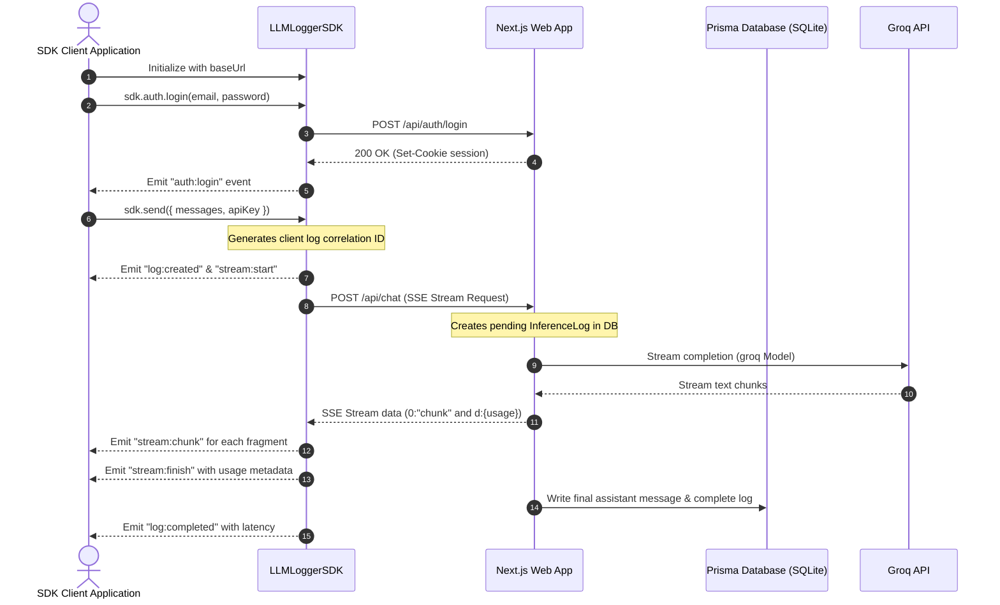

# Interview Checklist & Status

## Core Requirements
- [x] **GitHub Repository**: Complete source code and configurations.
- [x] **README**: Setup instructions, architecture overview, schema design decisions, tradeoffs, and improvements.
- [x] **Architecture Notes**: Ingestion flow, logging strategy, scaling, and failure handling assumptions.
- [x] **Demo**: Walkthrough guide, diagrams, and logs.

## Bonus Requirements
- [x] **Multi-provider support**: Dynamically routes requests to Groq, OpenAI, or Anthropic based on parameters or model prefixes.
- [x] **Streaming Responses**: Implemented real-time SSE chat streaming via Vercel AI SDK and Groq models.
- [x] **Latency + Throughput + Errors dashboards**: Live dashboard tracks request counts, token consumption, latencies, success rates, and errors.
- [x] **Docker Compose one-command setup**: Fully configured multi-stage Dockerfile and docker-compose.yml with SQLite database persistence.
- [x] **Event based architecture**: Event-driven client-side SDK that fires typed events for request lifecycle, auth, stream chunks/start/finish, and log status.
- [x] **PII redaction**: Filters emails, API keys, and credit cards from inputs and outputs before writing to DB.
- [ ] **Deploy application on self-hosted k8s**: Setup runs on local environment.

---

# LLM Logger & Event-Driven TypeScript SDK

[](#)
[](https://nextjs.org/)
[](https://www.prisma.io/)
[](#)
[](https://bun.sh/)
[](#)

LLM Logger is a comprehensive self-hosted platform designed to capture, log, monitor, and analyze LLM inference activity in real-time. It features a Next.js 16 dashboard UI, a SQLite/Prisma database engine, and an event-driven client-side SDK that supports streaming chat completions, session-based user authentication, conversation CRUD operations, and network telemetry logging.

---

## Application Walkthrough


---

## System Architecture



---

## Key Features

- **Real-Time Logging**: Tracks model inputs, outputs, token counts (prompt, completion, and total), network latency, status changes, and execution errors.
- **Event-Driven SDK**: Features typed event listeners to intercept authentication, conversation CRUD, SSE streaming chunks, and HTTP network telemetry.
- **Analytics Dashboard**: Visual UI illustrating requests, token consumption, error rates, average latency, and historical activity charts.
- **Session Authentication**: User registration, login verification, session validation, cookie-based session hydration, and sign-out capabilities.
- **Rate-Limiting Protection**: Integrates Upstash Redis rate limiting to mitigate API abuse (50 chat requests per 2 hours per user).

---

## Screenshots & Screen Recordings

<details>
<summary>📸 <strong>Chat Interface Screenshot</strong> - Click to view</summary>

The main chat interface showing real-time streaming responses:


Features visible:
- Clean, minimalist chat UI
- Model selection dropdown
- Real-time message streaming
- Conversation ID display
- User-friendly message input area
</details>

<details>
<summary>📸 <strong>Analytics Dashboard Screenshot</strong> - Click to view</summary>

The comprehensive analytics dashboard tracking system metrics:


Displays:
- Token consumption metrics
- Request counts and statistics
- Response latency tracking
- Error rate visualization
- Historical activity trends
- Per-model performance breakdown
</details>

<details>
<summary>📸 <strong>Multi-Conversation View Screenshot</strong> - Click to view</summary>

User's conversation history and management interface:


Includes:
- List of all user conversations
- Conversation metadata (title, model, creation date)
- Quick access to past conversations
- Conversation status indicators
- Easy navigation between chats
</details>

<details>
<summary>🎬 <strong>Screen Recording - Full Demo Walkthrough</strong> - Click to view</summary>

Complete demonstration of the application workflow:


The recording demonstrates:
- ✓ User navigating to the chat interface
- ✓ Sending a message to the LLM
- ✓ Real-time streaming response display
- ✓ Token count and latency tracking
- ✓ Analytics dashboard metrics update
- ✓ Conversation history preservation
- ✓ Switching between conversations
</details>

---

## Getting Started

### Prerequisites

Ensure you have the following installed on your machine:
- Node.js (version 20 or higher) or Bun (version 1.1 or higher)
- SQLite

### Environment Configuration

<details>
<summary>Click to view environment variables config details</summary>

Create a `.env` file in the root directory based on the variables below:

```bash
# Database connection string
DATABASE_URL="file:./prisma/dev.db"

# Session Encryption secret (minimum 32 characters)
SESSION_SECRET="generate-a-secure-32-character-random-string"

# Default server-side Groq API key
GROQ_API_KEY="gsk_your_groq_api_key_here"

# Next.js Application URL
NEXT_PUBLIC_APP_URL="http://localhost:3000"

# Optional Upstash Redis Configuration (for rate limiting)
UPSTASH_REDIS_REST_URL="https://your-database.upstash.io"
UPSTASH_REDIS_REST_TOKEN="your_upstash_token"
```
</details>

### Setup Instructions

#### Option A: Running Locally (NPM/Bun)

1. **Install Dependencies**:
   ```bash
   bun install
   # or
   npm install
   ```

2. **Run Database Migrations**:
   ```bash
   npx prisma db push
   ```

3. **Start Development Server**:
   ```bash
   bun dev
   # or
   npm run dev
   ```
   Open `http://localhost:3000` to access the web application.

#### Option B: Running with Docker Compose (One-Command Setup)

To build and run the application in a production-ready containerized environment with database persistence:

1. **Start the containers**:
   ```bash
   # Set API keys in your terminal and launch
   export GROQ_API_KEY="gsk_..."
   export OPENAI_API_KEY="sk_..."
   export ANTHROPIC_API_KEY="sk-ant-..."

   docker compose up --build -d
   ```
   This will automatically build the Next.js app, execute the Prisma migrations, bind to port `3000`, and persist the SQLite database in the host's `./prisma` directory.

---

## Testing the SDK

The SDK includes a comprehensive unit test suite and a capability demonstration script.

### 1. Automated Unit Tests

The unit tests use a mocked fetch interface to test the SDK EventBus, AuthManager, ConversationManager, and ChatManager under normal, error, and rate-limited conditions without requiring a running server.

To run the unit tests:
```bash
bun test
# or
npm run test
```

### 2. SDK Capability Demonstration

The capability test script runs a complete user lifecycle against the active local server:
- Registers a temporary test user.
- Verifies session hydration.
- Creates a new conversation.
- Sends a streaming chat completion (accepting `GROQ_API_KEY` from your local terminal environment to override server settings).
- Fetches the saved messages from the database.
- Lists the active conversations.
- Logs out.

To run the capability demo:
1. Ensure the local server is running: `bun dev` (or `npm run dev`).
2. Export your Groq API Key and run the script:
   ```bash
   export GROQ_API_KEY="gsk_..."
   bun run sdk:demo
   # or
   npm run sdk:demo
   ```

---

## Client SDK Integration Guide

<details>
<summary>Click to view SDK initialization and event subscriptions</summary>

### SDK Initialization

```typescript
import { LLMLoggerSDK } from "./sdk";

const sdk = new LLMLoggerSDK({
  baseUrl: "http://localhost:3000",
  timeout: 15000,
});
```

### Event Listeners

Every lifecycle moment emits a typed event you can subscribe to:

```typescript
// Subscribe to SSE chunks
sdk.on("stream:chunk", ({ chunk, accumulated }) => {
  process.stdout.write(chunk);
});

// Capture token usage on completion
sdk.on("stream:finish", ({ fullText, usage }) => {
  console.log("Tokens consumed:", usage);
});

// Capture network requests
sdk.on("request:start", ({ method, path, requestId }) => {
  console.log(`Starting ${method} ${path}`);
});
```
</details>

<details>
<summary>Click to view Authentication API calls</summary>

### Authentication Management

```typescript
// Register a new user
const user = await sdk.auth.register("email@example.com", "password123", "User Name");

// Log in
await sdk.auth.login("email@example.com", "password123");

// Re-hydrate session
const sessionUser = await sdk.init();

// Log out
await sdk.auth.logout();
```
</details>

<details>
<summary>Click to view Conversation CRUD API calls</summary>

### Conversation Management

```typescript
// List active conversations
const result = await sdk.conversations.list({ page: 1, limit: 10 });

// Create a new conversation
const conversation = await sdk.conversations.create({
  title: "New Chat Session",
  model: "llama-3.3-70b-versatile",
  provider: "groq"
});

// Retrieve conversation detail (includes message history)
const details = await sdk.conversations.get(conversation.id);

// Add message without calling LLM model
const msg = await sdk.conversations.addMessage(conversation.id, "user", "Hello database");

// Cancel a conversation
await sdk.conversations.cancel(conversation.id);

// Delete conversation and related logs
await sdk.conversations.delete(conversation.id);
```
</details>

<details>
<summary>Click to view Chat Streaming API calls</summary>

### Chat Streaming

```typescript
const result = await sdk.send({
  conversationId: "conv_123",
  model: "llama-3.3-70b-versatile",
  apiKey: "gsk_...", // Override server-side Groq key
  messages: [
    { role: "user", content: "Write a short poem" }
  ]
});

console.log("Completed response:", result.text);
```
</details>

---

## Available Scripts

<details>
<summary>Click to view package.json CLI scripts details</summary>

- `npm run dev`: Starts the Next.js development server.
- `npm run build`: Compiles the Next.js production build.
- `npm run start`: Runs the built Next.js production server.
- `npm run lint`: Validates code files against ESLint configurations.
- `npm run test`: Executes the SDK unit tests using Bun.
- `npm run sdk:demo`: Starts the SDK capability demonstration workflow.
</details>

---

## Architecture Notes & Design Decisions

<details>
<summary>Click to view Schema Design Decisions</summary>

### Relational Schema (Prisma + SQLite)
- **User Model**: Employs bcrypt hashing for password storage and unique email constraints to protect authentication.
- **Conversation Model**: Represents a single chat thread. Keeps metadata like the current model name, provider, and cancellation status.
- **Message Model**: Stores individual chat turn contents (role: system/user/assistant and raw content). Linked via a foreign key on `conversationId` with a cascade deletion trigger.
- **InferenceLog Model**: A dedicated, highly indexed table separate from the chat messages. It stores analytical metadata (latencyMs, promptTokens, completionTokens, totalTokens, status, error, requestedAt, respondedAt). Keeping this separate from the messages table allows the dashboard analytics engine to query metrics without fetching heavy text messages.
</details>

<details>
<summary>Click to view Architectural Notes (Ingestion, Logging, Scaling, Failures)</summary>

### Ingestion Flow & Logging Strategy
1. When a chat request begins, the Next.js API route `/api/chat` instantly creates a pending `InferenceLog` record in the database and returns a correlation handle to the client.
2. The server initializes `streamText` and pipes the SSE stream of tokens directly to the client.
3. Once the stream successfully completes or throws an exception, the `onFinish` or `catch` handler calculates the latency, fetches token usage, redacts PII from the logs, persists the final assistant message, and updates the `InferenceLog` status to `success` or `error`.
4. This ensures that even if a client disconnects mid-stream, the log entry is captured, calculating the time elapsed and marking the log as `cancelled` or `error`.

### PII Redaction
- Before any input or output previews are logged in the database, the system executes a PII redaction scanner that redacts:
  - Emails (replaced with `[EMAIL]`)
  - API Keys matching Sk/Gsk/Key patterns (replaced with `[API_KEY]`)
  - Credit card numbers matching 13-16 digit patterns (replaced with `[CREDIT_CARD]`)

### Scaling Considerations
- **SQLite Limitation**: SQLite is simple and file-based, meaning concurrent writes lock the entire database. In high-throughput settings, this will bottleneck. Transitioning to PostgreSQL (which is already configured as an option in `prisma/schema.prisma` and `.env`) is the recommended path for production scaling.
- **Ingestion Offloading**: Under extreme concurrency, writing logs synchronously during the request cycle can increase API latency. We would introduce a message broker (e.g. BullMQ/Redis, RabbitMQ, or Kafka) to offload log writes to a worker pool.

### Failure Handling Assumptions
- **Third-Party Downtime**: If the Groq API fails or is rate-limited, the system catches the error, marks the `InferenceLog` status as `error`, records the exception trace in the `error` column, and responds with a 502 status so the client app is aware without crashing.
- **Rate-Limiting**: Integrated Upstash Redis rate limiting on API paths. If rate limits are hit, the client receives a 429 status and the SDK fires `ratelimit:hit`.
</details>

<details>
<summary>Click to view Tradeoffs Made</summary>

### 1. Cookies vs JWTs for CLI SDK Session
- **Decision**: The Next.js app uses `iron-session` (stateless cookie-based session).
- **Tradeoff**: While stateless cookies are native to browsers, Node.js CLI runtimes do not store cookies by default. To bridge this, we modified the SDK's `HttpClient` to intercept the `Set-Cookie` headers and store/inject the cookie value manually. This avoided implementing a separate JWT auth path on the server.

### 2. Preview Truncation in Logs
- **Decision**: The `InferenceLog` model stores only the first 500 characters of inputs and outputs.
- **Tradeoff**: This limits the readability of extremely long prompts in the log viewer but saves significant storage database bloat and query latencies on the dashboard. The complete history is still accessible via the `Message` table.
</details>

<details>
<summary>Click to view Future Improvements (With More Time)</summary>

- **Analytics Aggregation**: Pre-calculate metrics hourly or daily into aggregated database tables to speed up dashboard queries for massive log datasets.
- **Self-Hosted Kubernetes Manifests**: Write Helm charts or Kubernetes YAML configurations for autoscaling the ingestion and web app services in production.
- **Log Archival Pipeline**: Establish an automated archival pipeline to cold-store logs older than 90 days in S3 or Google Cloud Storage to control SQLite/Postgres database bloat.
</details>
