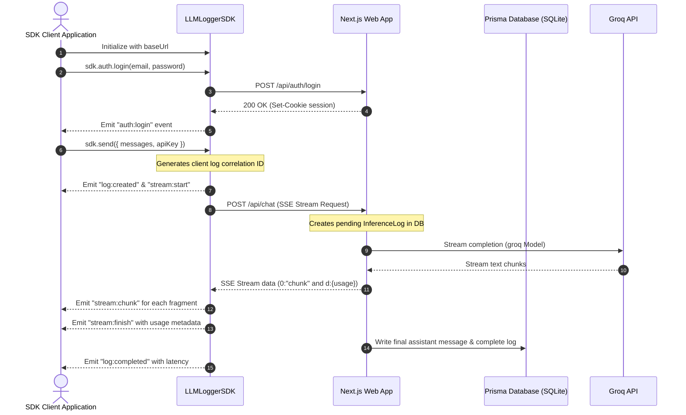

# LLM Logger & Event-Driven TypeScript SDK

[](#)
[](https://nextjs.org/)
[](https://www.prisma.io/)
[](#)
[](https://bun.sh/)
[](#)

LLM Logger is a comprehensive self-hosted platform designed to capture, log, monitor, and analyze LLM inference activity in real-time. It features a Next.js 16 dashboard UI, a SQLite/Prisma database engine, and an event-driven client-side SDK that supports streaming chat completions, session-based user authentication, conversation CRUD operations, and network telemetry logging.

---

## Application Walkthrough


---

## System Architecture



---

## Key Features

- **Real-Time Logging**: Tracks model inputs, outputs, token counts (prompt, completion, and total), network latency, status changes, and execution errors.
- **Event-Driven SDK**: Features typed event listeners to intercept authentication, conversation CRUD, SSE streaming chunks, and HTTP network telemetry.
- **Analytics Dashboard**: Visual UI illustrating requests, token consumption, error rates, average latency, and historical activity charts.
- **Session Authentication**: User registration, login verification, session validation, cookie-based session hydration, and sign-out capabilities.
- **Rate-Limiting Protection**: Integrates Upstash Redis rate limiting to mitigate API abuse (50 chat requests per 2 hours per user).

---

## Getting Started

### Prerequisites

Ensure you have the following installed on your machine:
- Node.js (version 20 or higher) or Bun (version 1.1 or higher)
- SQLite

### Environment Configuration

<details>
<summary>Click to view environment variables config details</summary>

Create a `.env` file in the root directory based on the variables below:

```bash
# Database connection string
DATABASE_URL="file:./prisma/dev.db"

# Session Encryption secret (minimum 32 characters)
SESSION_SECRET="generate-a-secure-32-character-random-string"

# Default server-side Groq API key
GROQ_API_KEY="gsk_your_groq_api_key_here"

# Next.js Application URL
NEXT_PUBLIC_APP_URL="http://localhost:3000"

# Optional Upstash Redis Configuration (for rate limiting)
UPSTASH_REDIS_REST_URL="https://your-database.upstash.io"
UPSTASH_REDIS_REST_TOKEN="your_upstash_token"
```
</details>

### Setup Instructions

1. **Install Dependencies**:
   ```bash
   bun install
   # or
   npm install
   ```

2. **Run Database Migrations**:
   ```bash
   npx prisma db push
   ```

3. **Start Development Server**:
   ```bash
   bun dev
   # or
   npm run dev
   ```
   Open `http://localhost:3000` to access the web application.

---

## Testing the SDK

The SDK includes a comprehensive unit test suite and a capability demonstration script.

### 1. Automated Unit Tests

The unit tests use a mocked fetch interface to test the SDK EventBus, AuthManager, ConversationManager, and ChatManager under normal, error, and rate-limited conditions without requiring a running server.

To run the unit tests:
```bash
bun test
# or
npm run test
```

### 2. SDK Capability Demonstration

The capability test script runs a complete user lifecycle against the active local server:
- Registers a temporary test user.
- Verifies session hydration.
- Creates a new conversation.
- Sends a streaming chat completion (accepting `GROQ_API_KEY` from your local terminal environment to override server settings).
- Fetches the saved messages from the database.
- Lists the active conversations.
- Logs out.

To run the capability demo:
1. Ensure the local server is running: `bun dev` (or `npm run dev`).
2. Export your Groq API Key and run the script:
   ```bash
   export GROQ_API_KEY="gsk_..."
   bun run sdk:demo
   # or
   npm run sdk:demo
   ```

---

## Client SDK Integration Guide

<details>
<summary>Click to view SDK initialization and event subscriptions</summary>

### SDK Initialization

```typescript
import { LLMLoggerSDK } from "./sdk";

const sdk = new LLMLoggerSDK({
  baseUrl: "http://localhost:3000",
  timeout: 15000,
});
```

### Event Listeners

Every lifecycle moment emits a typed event you can subscribe to:

```typescript
// Subscribe to SSE chunks
sdk.on("stream:chunk", ({ chunk, accumulated }) => {
  process.stdout.write(chunk);
});

// Capture token usage on completion
sdk.on("stream:finish", ({ fullText, usage }) => {
  console.log("Tokens consumed:", usage);
});

// Capture network requests
sdk.on("request:start", ({ method, path, requestId }) => {
  console.log(`Starting ${method} ${path}`);
});
```
</details>

<details>
<summary>Click to view Authentication API calls</summary>

### Authentication Management

```typescript
// Register a new user
const user = await sdk.auth.register("email@example.com", "password123", "User Name");

// Log in
await sdk.auth.login("email@example.com", "password123");

// Re-hydrate session
const sessionUser = await sdk.init();

// Log out
await sdk.auth.logout();
```
</details>

<details>
<summary>Click to view Conversation CRUD API calls</summary>

### Conversation Management

```typescript
// List active conversations
const result = await sdk.conversations.list({ page: 1, limit: 10 });

// Create a new conversation
const conversation = await sdk.conversations.create({
  title: "New Chat Session",
  model: "llama-3.3-70b-versatile",
  provider: "groq"
});

// Retrieve conversation detail (includes message history)
const details = await sdk.conversations.get(conversation.id);

// Add message without calling LLM model
const msg = await sdk.conversations.addMessage(conversation.id, "user", "Hello database");

// Cancel a conversation
await sdk.conversations.cancel(conversation.id);

// Delete conversation and related logs
await sdk.conversations.delete(conversation.id);
```
</details>

<details>
<summary>Click to view Chat Streaming API calls</summary>

### Chat Streaming

```typescript
const result = await sdk.send({
  conversationId: "conv_123",
  model: "llama-3.3-70b-versatile",
  apiKey: "gsk_...", // Override server-side Groq key
  messages: [
    { role: "user", content: "Write a short poem" }
  ]
});

console.log("Completed response:", result.text);
```
</details>

---

## Available Scripts

<details>
<summary>Click to view package.json CLI scripts details</summary>

- `npm run dev`: Starts the Next.js development server.
- `npm run build`: Compiles the Next.js production build.
- `npm run start`: Runs the built Next.js production server.
- `npm run lint`: Validates code files against ESLint configurations.
- `npm run test`: Executes the SDK unit tests using Bun.
- `npm run sdk:demo`: Starts the SDK capability demonstration workflow.
</details>
